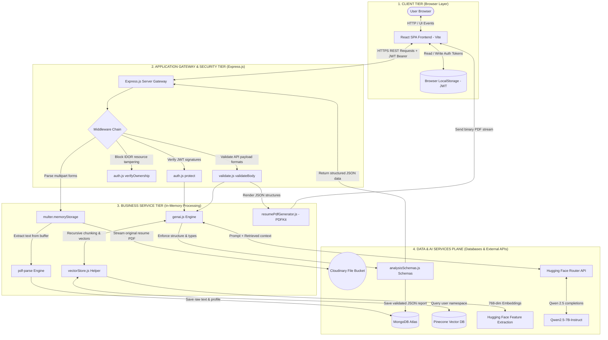

# AlignAI High-Level Design (HLD) Architecture & Data Flow

This document details the system design, components boundaries, and data transformations for the **AlignAI** platform.

---

## A. HLD Architecture Diagram

This diagram displays the flow of data through the platform, organized from the client-side user interface, down through security routing, in-memory business logic services, and into databases and external AI services.

---

## B. End-to-End Data Flows

The system operates four primary transaction flows, each with specific data transformations and communication pathways:

### 1. User Authentication & Session Flow
1. The User enters credentials in the React SPA.
2. The UI sends a POST request (`/api/auth/signup` or `/api/auth/login`) containing credentials to the Express backend.
3. The Express router hashes the password (for sign-up) and matches credentials against [MongoDB](file:///d:/Placement/Projects/GenAI/AlignAi/backend/src/models/User.js).
4. The server signs a JSON Web Token (JWT) with the backend’s secret signing key.
5. The backend returns the JWT in the response payload; the client stores it in `LocalStorage`.
6. For all subsequent requests, the React client automatically attaches the token in the `Authorization: Bearer <JWT>` header.

### 2. Resume Ingestion & In-Memory Indexing Flow
1. The User uploads a PDF resume and enters basic details on the intake page.
2. The Frontend initiates a POST request (`/api/upload`) containing the binary file buffer.
3. The Express routing gateway handles the request via `multer.memoryStorage()` to capture the file in RAM.
4. The route handler processes the file in parallel:
    *   **Text Extraction**: Passes the RAM buffer to `pdf-parse` which extracts raw string characters, updating the User document in **MongoDB**.
    *   **Asset Hosting**: Streams the buffer to **Cloudinary** and saves the returned media URL in **MongoDB**.
5. The extracted plain text is split into segments of 1000 characters (with 200-character overlap) via LangChain's `RecursiveCharacterTextSplitter`.
6. The server embeds each chunk as a 768-dimensional vector using the `sentence-transformers/all-mpnet-base-v2` model via Hugging Face.
7. These vectors, along with document metadata, are upserted into **Pinecone** under the user's namespace (`user-{userId}`) to ensure tenant data isolation.

### 3. Resume vs. Job Description Analysis Flow (RAG)
1. The User enters target Job Description (JD), Job Title, and Company Name.
2. The Frontend sends a POST request (`/api/analysis/analyze`) with the payload.
3. The `protect` middleware decodes the JWT to verify `userId`, and `validateBody` validates payload formatting.
4. The backend stores the target JD in the user’s Pinecone namespace as context memory.
5. The [`retrieveKnowledge`](file:///d:/Placement/Projects/GenAI/AlignAi/backend/src/utils/vectorStore.js#L247) helper queries Pinecone to fetch the top-6 relevant chunks of the candidate's resume, prior logs, and JD.
6. The retrieved chunks are formatted into a single text block and injected into the [`resumeAnalysisPrompt`](file:///d:/Placement/Projects/GenAI/AlignAi/backend/src/prompts/analysisPrompts.js).
7. The server calls the Hugging Face Router API (`Qwen2.5-7B-Instruct`), requesting a structured JSON analysis report.
8. The raw string is cleaned of markdown wrappers, parsed, and validated against the Zod schema [`resumeAnalysisSchema`](file:///d:/Placement/Projects/GenAI/AlignAi/backend/src/schemas/analysisSchemas.js#L66).
9. The server saves the validated JSON report to MongoDB under the user's history and returns it to the React client.

### 4. PDF Generation & Stream Download Flow
1. The User clicks "Download PDF" on the dashboard.
2. The Client triggers a POST request (`/api/analysis/download-resume-pdf`) containing the structured JSON resume text.
3. The backend routes the data to [`generateResumePdf`](file:///d:/Placement/Projects/GenAI/AlignAi/backend/src/utils/resumePdfGenerator.js#L127).
4. The PDFKit engine initializes a blank document canvas in memory.
5. It programmatically formats fonts (`Helvetica`, `Helvetica-Bold`), margins, and positions, drawing section lines and `[GAP]` warnings based on coordinate cursor positions (`doc.y`).
6. PDFKit compiles the canvas into a binary PDF buffer in RAM.
7. The Express controller sets response attachment headers, streams the binary buffer to the browser, and clears the memory allocation.

---

## C. Interview Explanation (60–90 Second Script)

> "AlignAI is a full-stack resume intelligence platform designed with a decoupled architecture that separates transactional operational data from semantic vector memories.
> 
> At the client tier, we have a React Single Page Application compiled with Vite. It interacts with our Node.js/Express backend using a custom fetch wrapper that handles authorization through signed JWT tokens. 
> 
> The application utilizes two separate storage planes: MongoDB Atlas manages transactional user profiles and history arrays, while Pinecone acts as our vector database. We ensure strict tenant data privacy by partitioning Pinecone vector indices into user-specific namespaces.
> 
> When a user uploads their resume, we process the file completely in-memory. We use Multer to capture the buffer, parse it via `pdf-parse`, and upload the raw asset to Cloudinary. The text is then chunked using LangChain and vectorized using a 768-dimensional model via Hugging Face.
> 
> During analysis, we run a RAG workflow: we retrieve the top-6 relevant chunks from Pinecone, inject them into our system prompt, and query Qwen 2.5. To protect our frontend and database from model hallucinations and schema parsing errors, we route the completions through runtime validation guardrails built with Zod schemas. Finally, optimized resumes are programmatically compiled into downloadable, ATS-compliant layouts in memory using PDFKit, keeping the backend stateless and scalable."
