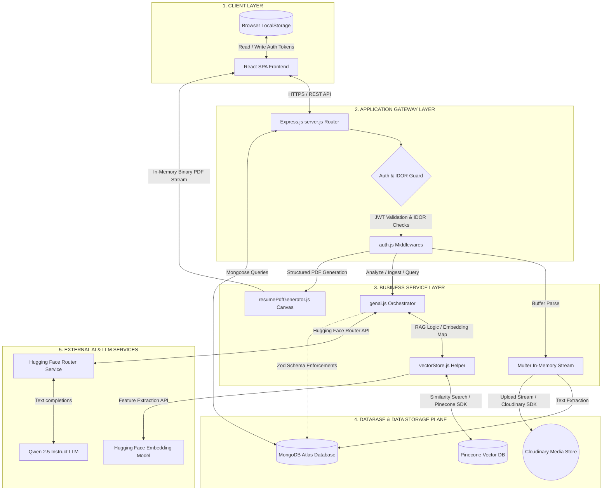

# AlignAI Component-Level High-Level Design (HLD) Architecture

This document outlines the structural component architecture and boundaries of the **AlignAI** platform, organized into logical application layers.

---

## A. HLD Architecture Diagram

The diagram below represents the system topology, showcasing how the client-side user interface, backend routing controllers, local database engines, and third-party AI services connect.

---

## B. Component Responsibilities

*   **React SPA Frontend:** Renders the user dashboard, handles multi-step intake wizard forms, and manages JWT tokens within client state.
*   **LocalStorage:** Caches active JWT access credentials and verified session flags locally in the browser.
*   **Express.js Server:** Mounts API routes, decodes request bodies, manages HTTP error states, and acts as the central coordination layer.
*   **Auth Guard Middlewares:** Decodes signed JWT headers to authenticate request origins and performs ownership parameter checks to block Insecure Direct Object Reference (IDOR) tampering.
*   **Multer In-Memory Stream:** Intercepts multipart/form-data uploads to capture PDF uploads inside RAM buffers, keeping the server stateless.
*   **genai.js Orchestrator:** Houses prompt formatting templates, extracts JSON blocks, and manages the execution flow for analysis, roadmaps, and interview preparations.
*   **resumePdfGenerator.js Canvas:** Renders JSON data into professionally formatted, single-column, ATS-friendly PDF resumes entirely in memory using the PDFKit library.
*   **vectorStore.js Helper:** Handles recursive character text splitting, initializes the PineconeStore connection, and partitions queries by namespace.
*   **MongoDB Atlas Database:** Persists operational database state, including user records, encrypted password hashes, and transactional history arrays.
*   **Cloudinary Media Store:** Serves as a media CDN to host and retrieve uploaded PDF resume documents.
*   **Pinecone Vector DB:** Provides a vector database index that isolates tenant document chunks inside user-specific namespaces.
*   **Hugging Face Embedding Model:** Generates 768-dimensional numerical vectors from raw text chunks using the `sentence-transformers/all-mpnet-base-v2` model.
*   **Hugging Face Router Service:** Routes chat completion requests in OpenAI-compatible formats to the `Qwen/Qwen2.5-7B-Instruct` model.

---

## C. 60-Second Interview Explanation

> "AlignAI is a full-stack resume optimization platform designed with a decoupled architecture organized into five logical layers.
> 
> At the **Client Layer**, we have a React Single Page Application compiled with Vite that communicates over HTTPS with our **Application Gateway Layer**, powered by Express.js. This gateway uses custom middlewares to handle authentication and IDOR security checks by validating signed JWT bearer tokens.
> 
> Business operations are handled in our **Business Service Layer**, which processes PDF extractions, coordinates prompt injection, and compiles PDF resumes programmatically in-memory using PDFKit.
> 
> Data persistence is split into two systems at the **Data Layer**: MongoDB Atlas stores user profiles and historical logs, while Cloudinary hosts raw PDF files.
> 
> Finally, our **External AI Layer** handles all semantic processing. We use LangChain to orchestrate similarity searches in Pinecone, partition data by user namespaces to ensure multi-tenant security, and call Hugging Face endpoints to handle embedding generation and Qwen 2.5 completions."
