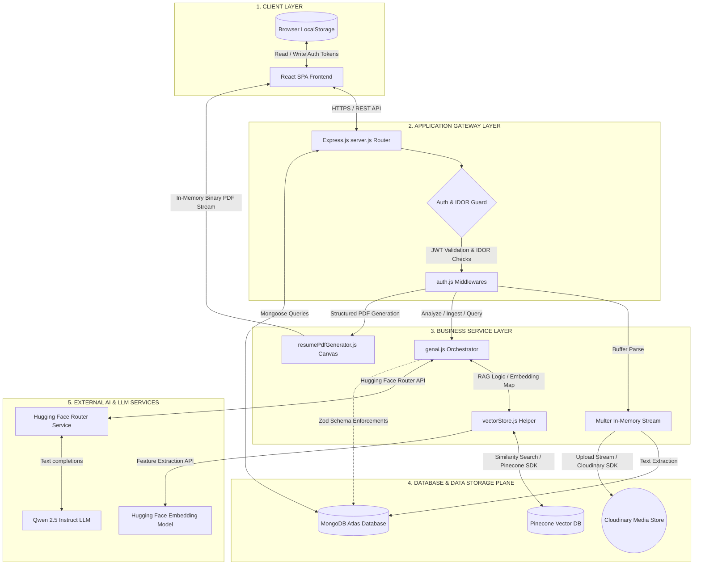

# AlignAI High-Level Design (HLD) Component Architecture & Interview Walkthrough

This document outlines the structural component architecture, logical boundaries, and a step-by-step whiteboard presentation script for the **AlignAI** platform. It is written in a conversational, engineer-to-engineer style specifically tailored for technical interviews.

---

## A. HLD Architecture Diagram

The diagram below represents the system topology, showcasing how the client-side user interface, backend routing controllers, in-memory processing services, database planes, and external AI services communicate.

---

## B. Component Responsibilities (Plain English)

Here is what each block on the board actually does:

1.  **React SPA Frontend**: Compiled with Vite for fast load times. Collects user input (resumes, job descriptions), renders dashboards, and communicates over standard HTTP client calls.
2.  **Browser LocalStorage**: Caches the signed JSON Web Token (JWT) on the client browser to maintain session persistence across page refreshes without stateful session tracking on the server.
3.  **Express.js `server.js` Router**: Our REST API gateway. It boots up the HTTP listener, hosts API endpoints, directs incoming requests to specific handlers, and coordinates responses.
4.  **Auth & IDOR Guard**: A critical security checkpoint. Any incoming request that requires credentials must go through this guard first.
5.  **`auth.js` Middlewares**: Decodes and verifies the JWT signature. It also performs IDOR (Insecure Direct Object Reference) checks, ensuring that a user ID extracted from a token matches the user ID parameter in the API path.
6.  **Multer In-Memory Stream**: Intercepts file uploads. Instead of writing files to local server disk storage, it holds the PDF in a RAM buffer to keep our backend instances stateless and light.
7.  **`genai.js` Orchestrator**: The central controller for AI tasks. It processes system prompts, strips markdown syntax from completions, extracts JSON blocks, and handles LLM interface configurations.
8.  **`resumePdfGenerator.js` Canvas**: Uses PDFKit to draw single-column resumes programmatically in-memory, computing line coordinates and page boundaries on the fly.
9.  **`vectorStore.js` Helper**: Coordinates text chunking, retrieves embeddings from the external API, and handles upserts/searches inside Pinecone.
10. **MongoDB Atlas Database**: The transactional system of record. Stores user profiles, credentials (hashed via bcrypt), resume text, metadata URLs, and analysis run history.
11. **Cloudinary Media Store**: A media-hosting CDN. We stream original binary PDFs here and save the returned asset URL in MongoDB.
12. **Pinecone Vector DB**: A vector database index where text chunks are indexed and retrieved using cosine similarity, partitioned strictly by user-specific namespaces.
13. **Hugging Face Embedding Model**: Uses `sentence-transformers/all-mpnet-base-v2` via a feature-extraction endpoint to turn text segments into 768-dimensional vector arrays.
14. **Hugging Face Router Service**: An API gateway wrapper that helps route LLM requests to prevent socket disconnects and provide OpenAI-compatible syntax.
15. **Qwen 2.5 Instruct LLM**: The open-source instruction-tuned model that processes RAG prompts to generate analysis scores, gap logs, and tailored resume bullet points.

---

## C. The 60-Second Interview Pitch

*Use this when the interviewer asks: **"Can you give me a high-level overview of this architecture?"***

> "AlignAI is structured as a decoupled web application divided into five logical layers to achieve clear separation of concerns. 
> 
> At the **Client Layer**, we have a React SPA communicating via HTTPS REST APIs with our **Application Gateway Layer** built on Express.js. This gateway uses custom middlewares to handle authentication and IDOR checks by verifying signed JWT tokens. 
> 
> Business operations are handled in our **Business Service Layer**, which parses PDFs, coordinates prompt injections, and generates PDF resumes dynamically in RAM.
> 
> Data persistence is split into three systems at the **Data Storage Plane**: MongoDB Atlas stores user profiles and transaction history, Cloudinary hosts original PDF assets, and Pinecone manages our vector embeddings. 
> 
> Finally, our **External AI Layer** handles semantic extraction and LLM generations. We chunk resume data, send it to a Hugging Face embedding endpoint, index the vectors in Pinecone under user-isolated namespaces, and request structured completions from the Qwen 2.5 model via a Hugging Face router, validating the outputs using Zod schemas before persisting them."

---

## D. Step-by-Step Whiteboard Presentation Script

*This is a spoken script to guide you as you draw the diagram on the whiteboard. It replaces dry definitions with engaging engineering talk.*

### Layout Setup: Setting up the Columns
**What to Do:**
*   Stand up, grab a marker, and draw four vertical dashed lines to divide the whiteboard into five equal columns.
*   Write the titles at the top of each column:
    1. `CLIENT LAYER`
    2. `APPLICATION GATEWAY`
    3. `BUSINESS SERVICES`
    4. `DATA & PERSISTENCE`
    5. `EXTERNAL AI & LLM`

**What to Say:**
> "To explain the topology of AlignAI, I'll organize our components into five vertical columns. This represents how we pass requests from the client's web browser, through our stateless security layer, down into in-memory processors, and out to our databases and third-party AI models. This structure helps keep our system stateless and easy to scale."

---

### Step 1: Drawing the CLIENT LAYER
**What to Do:**
*   In the first column, draw a box labeled `React SPA Frontend`.
*   Below it, draw a small storage box labeled `Browser LocalStorage`.
*   Draw a double-sided arrow between them labeled `Read / Write Auth Tokens`.

**What to Say:**
> "At the client layer, we have our `React SPA`. I compiled this with Vite to ensure fast load times and keep client routing responsive. 
> 
> Below it, I'm drawing `Browser LocalStorage`. Since we don't store session states on the server, the React app writes the signed JWT bearer token here after a user logs in. For every subsequent request, React reads this token and injects it into the HTTP headers so the gateway can verify who is making the request."

---

### Step 2: Drawing the APPLICATION GATEWAY LAYER
**What to Do:**
*   In the second column, draw a box labeled `Express.js server.js Router`.
*   Draw an arrow from `React SPA` to this box, labeled `HTTPS / REST API`.
*   Inside the Express box, draw a diamond shape labeled `Auth & IDOR Guard`.
*   Below it, draw a box labeled `auth.js Middlewares` and connect them with an arrow labeled `JWT Validation & IDOR Checks`.

**What to Say:**
> "Next is the Application Gateway. The React SPA sends HTTPS REST API calls to our `Express.js Router`. 
> 
> Before any request hits our business services, it must pass this validation diamond. The router sends the request parameters and headers to our `auth.js Middlewares`. 
> 
> This middleware decodes the JWT signature to verify it wasn't tampered with. It also performs Insecure Direct Object Reference, or IDOR, checks. By verifying that the user ID in the signed token matches the user ID in the request parameters, we prevent malicious users from modifying another candidate's profile."

---

### Step 3: Drawing the BUSINESS SERVICE LAYER
**What to Do:**
*   In the third column, draw three boxes stacked vertically:
    *   Top: `Multer In-Memory Stream`
    *   Middle: `genai.js Orchestrator`
    *   Bottom: `resumePdfGenerator.js Canvas`
*   Draw three arrows extending from `auth.js Middlewares` to these boxes, labeled:
    *   To Multer: `Buffer Parse`
    *   To genai.js: `Analyze / Ingest / Query`
    *   To resumePdfGenerator.js: `Structured PDF Generation`
*   Next to `genai.js Orchestrator`, draw `vectorStore.js Helper`. Connect them with a double-sided arrow labeled `RAG Logic / Embedding Map`.

**What to Say:**
> "In the Business Service column, everything runs in RAM to minimize disk latency. I've broken this down into three dedicated services:
> 
> *   At the top is `Multer`. When a resume is uploaded, Multer intercepts the binary stream and buffers it in memory. This avoids writing files to local disk, making it perfect for serverless deployments.
> *   In the middle is our `genai.js Orchestrator`. It acts as the coordinator for prompt structures, response parsing, and validation.
> *   Next to it, I'm drawing our `vectorStore.js Helper`. The orchestrator uses this helper to chunk raw text and coordinate with the vector database.
> *   At the bottom, we have our `resumePdfGenerator.js Canvas`. This service uses PDFKit to draw and compile the optimized resume layout programmatically in RAM."

---

### Step 4: Drawing the DATABASE & DATA STORAGE PLANE
**What to Do:**
*   In the fourth column, draw three database cylinders vertically:
    *   Top: `MongoDB Atlas Database`
    *   Middle: `Cloudinary Media Store`
    *   Bottom: `Pinecone Vector DB`
*   Draw arrows from:
    *   `Multer` (column 3) $\rightarrow$ `MongoDB` (column 4), labeled `Text Extraction`.
    *   `Multer` (column 3) $\rightarrow$ `Cloudinary` (column 4), labeled `Upload Stream / Cloudinary SDK`.
    *   `vectorStore.js Helper` (column 3) $\leftrightarrow$ `Pinecone` (column 4), labeled `Similarity Search / Pinecone SDK`.

**What to Say:**
> "For our databases, we split our data plane into three systems based on access patterns:
> 
> *   First, `MongoDB Atlas`. Once Multer buffers a resume, we extract its text in RAM and save it to MongoDB. MongoDB stores our user profiles, account metadata, and history logs.
> *   Second, `Cloudinary`. We stream the raw binary PDF file directly from memory to Cloudinary via their SDK and save the URL in MongoDB.
> *   Third, `Pinecone Vector DB`. We use Pinecone to store and search vector representations of text. To guarantee data isolation in a shared index, we partition vectors using candidate-specific namespaces. When we search or write, we restrict Pinecone to that user's namespace."

---

### Step 5: Drawing the EXTERNAL AI & LLM SERVICES
**What to Do:**
*   In the fifth column, draw three boxes vertically:
    *   Top: `Hugging Face Embedding Model`
    *   Middle: `Hugging Face Router Service`
    *   Bottom: `Qwen 2.5 Instruct LLM`
*   Draw arrows:
    *   `vectorStore.js Helper` (column 3) $\rightarrow$ `Hugging Face Embedding Model` (column 5), labeled `Feature Extraction API`.
    *   `genai.js Orchestrator` (column 3) $\leftrightarrow$ `Hugging Face Router Service` (column 5), labeled `Hugging Face Router API`.
    *   `Hugging Face Router Service` (column 5) $\leftrightarrow$ `Qwen 2.5 Instruct LLM` (column 5), labeled `Text completions`.

**What to Say:**
> "Finally, let's look at the External AI services. 
> 
> When our vector helper needs to index or query text, it sends text chunks to the `Hugging Face Embedding Model` API. This model takes text inputs and returns 768-dimensional vector arrays representing their semantic meaning.
> 
> To generate suggestions or rewrite resume bullet points, our orchestrator communicates with the `Qwen 2.5 Instruct LLM` using the `Hugging Face Router Service`. This router translates prompts to an OpenAI-compatible format and helps prevent network disconnects."

---

### Step 6: Drawing Cross-Layer Feedback Loops
**What to Do:**
*   Draw a long return line from `PDFKit Canvas` (column 3) back to `React SPA Frontend` (column 1), and label it: `In-Memory Binary PDF Stream`.
*   Draw a double-sided arrow between `MongoDB` (column 4) and `Express.js Router` (column 2), and label it: `Mongoose Queries`.
*   Draw a dashed line from `genai.js Orchestrator` (column 3) to `MongoDB` (column 4), and label it: `Zod Schema Enforcements`.

**What to Say:**
> "To wrap up the diagram, I'll add three feedback loops:
> 
> *   First, a return loop from our `PDFKit Canvas` back to the `React SPA`. When a user requests a download, the canvas compiles the buffer and streams the binary PDF directly to the browser, bypassing local disk writes entirely.
> *   Second, a database loop between `MongoDB` and `Express` representing transactional lookups and account updates.
> *   Third, a dashed line from our `genai.js Orchestrator` to `MongoDB`. This is our schema guardrail: before saving any AI-generated report, we validate the parsed JSON output against our Zod schema. If it fails, we reject it to prevent corrupt data from reaching our database."

---

## E. End-to-End Core Data Flows (Trace on Board)

### 1. Ingestion Flow (PDF Upload to RAG Index)
*   **Step A**: The client uploads a PDF resume. The request goes over HTTPS to `/api/upload`.
*   **Step B**: The `protect` middleware decodes the JWT to verify the user.
*   **Step C**: Multer captures the file buffer in memory. The system extracts the text using `pdf-parse` and concurrently streams the PDF to Cloudinary.
*   **Step D**: MongoDB is updated with the candidate's profile records.
*   **Step E**: The text is split into chunks of 1000 characters with a 200-character overlap.
*   **Step F**: We send these chunks to the Hugging Face Feature Extraction API to get 768-dimensional embeddings, which are then saved in Pinecone under the user's namespace (`user-namespace-{userId}`).

### 2. RAG Match Analysis Flow (Resume vs. JD)
*   **Step A**: The client sends a target job description to `/api/analysis/analyze`.
*   **Step B**: The backend embeds the job description text and queries Pinecone.
*   **Step C**: Pinecone retrieves the **top 6 most relevant text chunks** from the candidate's namespace.
*   **Step D**: The orchestrator injects these chunks and the target job description into the system prompt.
*   **Step E**: We send the combined prompt to the Hugging Face Router API, which returns a raw string response from Qwen 2.5.
*   **Step F**: The orchestrator extracts the JSON substring, runs it through a Zod schema validation check, saves the report to MongoDB, and returns the JSON payload to the React dashboard.

### 3. PDF Resume Generation Flow
*   **Step A**: The client requests a tailored resume download by sending the improved JSON data to `/api/analysis/download-resume-pdf`.
*   **Step B**: Our canvas engine initializes a blank letter-sized document in RAM.
*   **Step C**: The engine iterates through the JSON sections, drawing text and borders. It checks vertical cursor boundaries to handle page breaks automatically.
*   **Step D**: The backend sets the attachment download headers and streams the binary buffer directly to the user's browser.

---

## F. Key Design Decisions & Trade-offs (The "Why")

*Be prepared to discuss these design choices during your interview. Frame them as intentional decisions with clear trade-offs.*

### 1. Pinecone Namespaces vs. Isolated Indices
*   **Decision**: We partition a single, shared vector index using user-specific namespaces.
*   **Why**: Creating a dedicated index for each user is expensive and doesn't scale well. Namespaces isolate data logically within a single index.
*   **Trade-off**: We cannot perform global vector queries across all users without iterating through namespaces. If strict data compliance is required (e.g., enterprise clients), isolating indexes would be the alternative.

### 2. In-Memory Processing vs. Local Disk Storage
*   **Decision**: We process PDF files and generate exports entirely in RAM using Multer and PDFKit.
*   **Why**: Writing file uploads to local disk requires managing persistent storage volumes, which limits scaling in containerized or serverless environments.
*   **Trade-off**: Concurrent uploads of large files can cause RAM usage to spike. We address this by setting a strict 2MB file size limit in our Multer middleware.

### 3. Structured LLM Responses with Custom JSON Extraction & Zod Guardrails
*   **Decision**: We instruct the model to return JSON, clean raw string outputs, and validate the schema using Zod.
*   **Why**: LLMs are non-deterministic and can return conversational text or invalid JSON. Zod ensures that the parsed output contains all required fields before it is stored in our database.
*   **Trade-off**: Validation checks add minor latency and require maintaining schemas in code.

---

## G. Common Interview Q&A on Failures & Edge Cases

*   **Q: What happens if Pinecone is down?**
    *   *A:* Our `vectorStore.js` helper catches the connection error. Instead of failing the request, it notifies the orchestrator, which falls back to sending the raw resume text from MongoDB directly to Qwen 2.5. This ensures the user still receives an analysis report, even if it lacks some semantic context.
*   **Q: How do you handle malformed or empty PDF uploads?**
    *   *A:* The `pdf-parse` library throws an exception if a file buffer is corrupted or empty. Our router catches this error and returns an HTTP 400 response advising the user to upload a standard, text-based PDF.
*   **Q: What would you do differently if you had to scale this to 1 million users?**
    *   *A:* I would make three primary upgrades:
        1.  **Background Queue-Worker Architecture**: Move PDF parsing, Cloudinary uploads, and vector indexing into background jobs using Redis and BullMQ. This prevents requests from timing out if external APIs slow down.
        2.  **HttpOnly Cookie Sessions**: Instead of caching JWT tokens in local storage (which is vulnerable to XSS attacks), I would store them in secure, HttpOnly cookies.
        3.  **Template-based PDF Generation**: Replace PDFKit coordinate drawing with a headless browser service (like Puppeteer) that renders HTML templates to PDFs. This makes it easier to update and maintain templates.
