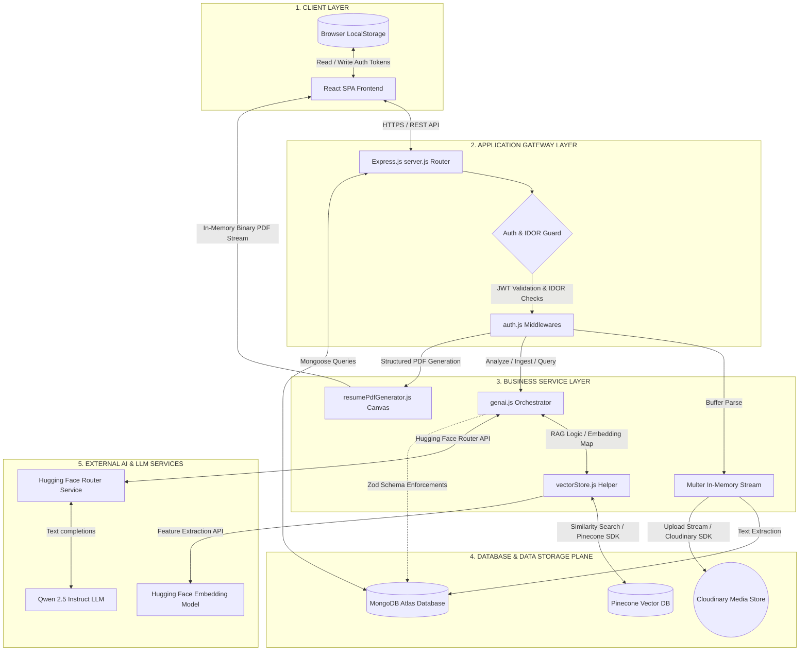

# AlignAI Component-Level High-Level Design (HLD) Architecture

This document outlines the structural component architecture and boundaries of the **AlignAI** platform, organized into logical application layers.

---

## A. HLD Architecture Diagram

The diagram below represents the system topology, showcasing how the client-side user interface, backend routing controllers, local database engines, and third-party AI services connect.



---

## B. Component Responsibilities

*   **React SPA Frontend:** Renders the user dashboard, handles multi-step intake wizard forms, and manages JWT tokens within client state.
*   **LocalStorage:** Caches active JWT access credentials and verified session flags locally in the browser.
*   **Express.js Server:** Mounts API routes, decodes request bodies, manages HTTP error states, and acts as the central coordination layer.
*   **Auth Guard Middlewares:** Decodes signed JWT headers to authenticate request origins and performs ownership parameter checks to block Insecure Direct Object Reference (IDOR) tampering.
*   **Multer In-Memory Stream:** Intercepts multipart/form-data uploads to capture PDF uploads inside RAM buffers, keeping the server stateless.
*   **genai.js Orchestrator:** Houses prompt formatting templates, extracts JSON blocks, and manages the execution flow for analysis, roadmaps, and interview preparations.
*   **resumePdfGenerator.js Canvas:** Renders JSON data into professionally formatted, single-column, ATS-friendly PDF resumes entirely in memory using the PDFKit library.
*   **vectorStore.js Helper:** Handles recursive character text splitting, initializes the PineconeStore connection, and partitions queries by namespace.
*   **MongoDB Atlas Database:** Persists operational database state, including user records, encrypted password hashes, and transactional history arrays.
*   **Cloudinary Media Store:** Serves as a media CDN to host and retrieve uploaded PDF resume documents.
*   **Pinecone Vector DB:** Provides a vector database index that isolates tenant document chunks inside user-specific namespaces.
*   **Hugging Face Embedding Model:** Generates 768-dimensional numerical vectors from raw text chunks using the `sentence-transformers/all-mpnet-base-v2` model.
*   **Hugging Face Router Service:** Routes chat completion requests in OpenAI-compatible formats to the `Qwen/Qwen2.5-7B-Instruct` model.

## C. 60-Second Interview Explanation

> "AlignAI is a full-stack resume optimization platform designed with a decoupled architecture organized into five logical layers.
> 
> At the **Client Layer**, we have a React Single Page Application compiled with Vite that communicates over HTTPS with our **Application Gateway Layer**, powered by Express.js. This gateway uses custom middlewares to handle authentication and IDOR security checks by validating signed JWT bearer tokens.
> 
> Business operations are handled in our **Business Service Layer**, which processes PDF extractions, coordinates prompt injection, and compiles PDF resumes programmatically in-memory using PDFKit.
> 
> Data persistence is split into two systems at the **Data Layer**: MongoDB Atlas stores user profiles and historical logs, while Cloudinary hosts raw PDF files.
> 
> Finally, our **External AI Layer** handles all semantic processing. We use LangChain to orchestrate similarity searches in Pinecone, partition data by user namespaces to ensure multi-tenant security, and call Hugging Face endpoints to handle embedding generation and Qwen 2.5 completions."

---

## D. Whiteboard Drawing & Interview Walkthrough Script

This section provides a detailed script of what to say and do as you draw the AlignAI component architecture diagram on a whiteboard during a system design or technical interview. It explains each component, interaction, and data transformation step in a conversational, human-friendly manner.

### Phase 1: Setting up the Whiteboard Layout
**What to Do:**
1. Stand at the whiteboard, take a marker, and draw four vertical dashed lines from the top of the board to the bottom, dividing the whiteboard into five columns.
2. Label these columns from left to right:
   *   `1. Client Layer`
   *   `2. Security Gateway`
   *   `3. Processing Services`
   *   `4. Database & Storage`
   *   `5. External AI Layer`

**What to Say:**
> "To keep our discussion organized, I'll divide the whiteboard into five logical columns. This represents the flow of requests from the user’s browser, through our security boundaries, into our business logic layers, and finally to our persistence and generative AI backends. 
> 
> This organization helps separate our frontend interfaces, backend routing, operational data persistence, and the semantic retrieval layer. By dividing the system this way, we can easily trace the boundaries of data ownership and pinpoint where our synchronous gateways transform into third-party asynchronous services."

---

### Phase 2: Drawing the Client Layer
**What to Do:**
1. In the first column (`1. Client Layer`), draw a large box and label it `React SPA Frontend (Vite)`.
2. Below the main React SPA box, draw a small bubble and label it `LocalStorage (JWT)`.
3. Draw a double-sided arrow connecting the `React SPA` box and the `LocalStorage` bubble, labeling the connection: `Read/Write Session Token`.

```text
  [ Client Layer ]
 ┌─────────────────┐
 │    React SPA    │
 │    Frontend     │
 └────────┬────────┘
          │ (Read/Write Tokens)
 ┌────────▼────────┐
 │  LocalStorage   │
 │   (JWT Cache)   │
 └─────────────────┘
```

**What to Say:**
> "Let’s start with the client layer. Our frontend is a Single Page Application built using React and compiled with Vite. I chose Vite because it gives a fast developer experience and compiles down to lightweight static assets. 
> 
> Since our system is stateless, the frontend needs to manage the user’s session token. We do this by storing a signed JSON Web Token in the browser’s LocalStorage. Whenever the React client boots up, it reads this token. For any subsequent REST API requests, the client injects this token directly into the Authorization Bearer header. 
> 
> When the user logs out, we clear this LocalStorage item, terminating the session client-side. The key design goal here is keeping the frontend decoupled from backend session storage, allowing us to scale the API layer independently."

---

### Phase 3: Drawing the Application Gateway Layer
**What to Do:**
1. In the second column (`2. Security Gateway`), draw a box and label it `Express.js Router (server.js)`.
2. Draw a directional arrow from the `React SPA Frontend` in column 1 to the `Express.js Router` in column 2, labeling it: `HTTPS / JSON Payload`.
3. Inside the `Express.js Router` box, draw a nested diamond shape and label it `Auth Guard Middleware`.
4. Draw an arrow extending from the diamond to a small box below labeled `auth.js: protect() & verifyOwnership()`.

```text
  [ Client Layer ]             [ Security Gateway ]
 ┌─────────────────┐  HTTPS   ┌─────────────────────┐
 │    React SPA    ├─────────>│  Express.js Router  │
 │    Frontend     │  Bearer  │ ┌─────────────────┐ │
 └─────────────────┘  Token   │ │   Auth Guard    │ │
                              │ └────────┬────────┘ │
                              └──────────┼──────────┘
                                         │ Decode Token
                              ┌──────────▼──────────┐
                              │    auth.js Guard    │
                              └─────────────────────┘
```

**What to Say:**
> "Now, as the user interacts with the app, their requests cross the network boundary via HTTPS. In the second column, I'm drawing the Application Gateway, which is an Express.js server running in Node.js. The main entry point is `server.js`.
> 
> When a request hits our backend, before we touch any database or perform any business logic, it passes through a series of security filters. I'm drawing our Auth Guard Middleware diamond here to represent this layer. 
> 
> First, a helper middleware called `protect()` extracts the JWT from the header, validates its cryptographic signature using our server secret, and decodes the payload to bind the user’s ID to the request object. 
> 
> Second, to prevent Insecure Direct Object Reference or IDOR attacks—where User A tries to view User B’s history by guessing their database ID in the URL—we run a custom check called `verifyOwnership()`. This middleware compares the decoded user ID from the signed token with the user parameters in the request path. If they don't match, we block the request immediately at the gate and return a 403 Forbidden status code. This keeps our security boundaries rigid."

---

### Phase 4: Drawing the Business Service Layer
**What to Do:**
1. In the third column (`3. Processing Services`), draw three boxes vertically stacked:
   *   Top: `Multer In-Memory Storage`
   *   Middle: `genai.js Orchestrator`
   *   Bottom: `PDFKit Canvas Engine`
2. Draw a directional arrow from the `Auth Guard Middleware` (column 2) to each of these three boxes.
3. Next to the `Multer` box, draw a small circle labeled `pdf-parse Engine` and connect them with an arrow.
4. Next to the `genai.js Orchestrator` box, draw a small box labeled `vectorStore.js Helper` and connect them with a double-sided arrow.

```text
  [ Security Gateway ]            [ Processing Services ]
 ┌─────────────────────┐         ┌─────────────────────────┐
 │  Express.js Router  │────────>│  Multer Memory Buffer   │──> [pdf-parse]
 │  (Auth & IDOR Guard)│         └─────────────────────────┘
 └─────────────────────┘         ┌─────────────────────────┐
            │                    │  genai.js Orchestrator  │<─> [vectorStore.js]
            └───────────────────>└─────────────────────────┘
            │                    ┌─────────────────────────┐
            └───────────────────>│   PDFKit Canvas Engine  │
                                 └─────────────────────────┘
```

**What to Say:**
> "Once the request is authenticated and verified, it moves into our third column: the Business Service Layer. This layer is entirely stateless and operates in-memory to keep performance high and support serverless deployment targets. I'm drawing three primary components here:
> 
> First, at the top, is our file ingestion engine. When a user uploads a resume, we don't save files to a temporary disk. Instead, we use `multer` configured with memory storage, which captures the binary PDF stream as a Buffer in RAM. We immediately pass this buffer to the `pdf-parse` library to extract raw text strings. This keeps the node instance lightweight and avoids filesystem write collisions under load.
> 
> In the middle is our `genai.js Orchestrator`. This is the core intelligence component of the application. It maps our prompt templates, handles context aggregation, extracts JSON substrings from model responses, and coordinates the flow for our resume analysis, roadmaps, and mock interview engines.
> 
> At the bottom is our `PDFKit Canvas Engine`. When a user requests a downloadable version of their rewritten resume, this service takes the optimized JSON data and programmatically draws a single-column, clean layout page-by-page. It calculates line wrapping and cursor coordinates dynamically, converting structured data back into a binary PDF buffer in-memory to stream it back to the user."

---

### Phase 5: Drawing the Database & Storage Layer
**What to Do:**
1. In the fourth column (`4. Database & Storage`), draw three cylinders to represent different database and storage systems:
   *   Top: `Cloudinary Media Store`
   *   Middle: `MongoDB Atlas (Transactional)`
   *   Bottom: `Pinecone Vector DB`
2. Draw a dashed arrow from the `Multer In-Memory Storage` box (column 3) to the `Cloudinary Media Store` cylinder.
3. Draw a solid arrow from the `pdf-parse Engine` circle (column 3) to the `MongoDB Atlas` cylinder, labeling it: `Mongoose Schema Write`.
4. Draw an arrow from the `vectorStore.js Helper` (column 3) to the `Pinecone Vector DB` cylinder, labeling it: `Upsert/Query Namespace`.

```text
  [ Processing Services ]             [ Database & Storage ]
 ┌─────────────────────────┐         ┌──────────────────────┐
 │  Multer Memory Buffer   │- - - - >│   Cloudinary Store   │
 └─────────────────────────┘         └──────────────────────┘
 ┌─────────────────────────┐         ┌──────────────────────┐
 │     pdf-parse Engine    │────────>│    MongoDB Atlas     │
 └─────────────────────────┘         └──────────────────────┘
 ┌─────────────────────────┐         ┌──────────────────────┐
 │   vectorStore.js Helper │────────>│  Pinecone Vector DB  │
 └─────────────────────────┘         └──────────────────────┘
```

**What to Say:**
> "Now let's talk about where this data goes. In column four, we have our database and storage tier. A key design pattern in AlignAI is the separation of our data planes into three separate systems based on access patterns:
> 
> First, at the top, we have the Cloudinary Media Store. We stream the original PDF buffer here asynchronously. This gives us a hosted URL for the raw file, which we save in the user's document as a profile metadata asset.
> 
> In the middle is MongoDB Atlas, which is our primary transactional database. We use Mongoose models to handle user credentials, password hashes, and profile fields. It also stores historical analysis logs. MongoDB is a great fit here because our history schema contains nested arrays of suggestions and strengths that can evolve over time.
> 
> At the bottom is the Pinecone Vector Database. Pinecone is a vector-native index designed specifically for semantic search. Rather than storing full user documents, it stores high-dimensional vector representations of our text chunks along with metadata payloads. 
> 
> To ensure data privacy, we partition Pinecone using user namespaces. This means when we execute a query or upsert, the database engine physically limits the search to the partition matching that specific user ID, preventing cross-user data leakage at the database level."

---

### Phase 6: Drawing the External AI Layer
**What to Do:**
1. In the fifth column (`5. External AI Layer`), draw three boxes:
   *   Top: `Hugging Face Feature Extraction`
   *   Middle: `Hugging Face Router API`
   *   Bottom: `Qwen 2.5 Instruct LLM`
2. Draw a directional arrow from the `vectorStore.js Helper` (column 3) to the `Hugging Face Feature Extraction` box, labeling it: `Text Chunks -> 768-dim Vectors`.
3. Draw a directional arrow from the `Hugging Face Feature Extraction` box back to `vectorStore.js Helper`, representing the returned vector arrays.
4. Draw a double-sided arrow between `genai.js Orchestrator` (column 3) and `Hugging Face Router API` (column 5), labeling it: `HTTPS / chat completions`.
5. Connect `Hugging Face Router API` to the `Qwen 2.5 Instruct LLM` box with an arrow.

```text
  [ Processing Services ]              [ External AI Layer ]
 ┌─────────────────────────┐          ┌──────────────────────┐
 │  vectorStore.js Helper  │<────────>│ HF Feature Extractor │ (Embeddings)
 └─────────────────────────┘          └──────────────────────┘
 ┌─────────────────────────┐          ┌──────────────────────┐
 │  genai.js Orchestrator  │<────────>│ HF Router API (Chat) │ (LLM Gateway)
 └─────────────────────────┘          └──────────┬───────────┘
                                                 │
                                      ┌──────────▼───────────┐
                                      │  Qwen 2.5 Instruct   │ (AI Model)
                                      └──────────────────────┘
```

**What to Say:**
> "Finally, let's look at how our business logic communicates with external machine learning components. In column five, we have the External AI Layer.
> 
> When our `vectorStore.js` helper needs to index text or perform a similarity search, it first sends the raw text chunks to the Hugging Face Feature Extraction API. This endpoint runs the `sentence-transformers/all-mpnet-base-v2` model, which takes the text strings and converts them into 768-dimensional numerical vectors. We return these arrays to Node, which then routes them to Pinecone.
> 
> When we need to perform reasoning—such as calculating a match score or generating resume rewrites—our `genai.js` orchestrator formats the system and user prompt messages and sends them to the Hugging Face Router API. 
> 
> We shifted to the Hugging Face Router base because it uses an OpenAI-compatible format which is robust and avoids local network timeout bugs. The router forwards these completions requests to the `Qwen2.5-7B-Instruct` model, which generates our response. 
> 
> Once Qwen returns the raw completion, the backend extracts the JSON substring, runs it through our Zod schema guardrails to enforce field typing, saves the validated report to MongoDB, and returns it to the client dashboard."

---

### Phase 7: Whiteboard Walkthrough of the PDF Ingestion Flow
**What to Do:**
1. Pick up a red marker (or point to the arrows with your finger) to trace the end-to-end data path as the user uploads a resume.
2. Trace the path: `User Browser` -> `React SPA` -> `Express.js Router` -> `Multer` -> `pdf-parse` -> `MongoDB` & `Cloudinary`.
3. Then trace from `pdf-parse` -> `vectorStore.js` -> `Hugging Face Feature Extraction` -> `vectorStore.js` -> `Pinecone User Namespace`.

```text
  [Client] ──(PDF File)──> [Express Gateway] ──> [Multer Memory Buffer]
                                                       │
                           ┌───────────────────────────┴───────────────────────────┐
                           ▼                                                       ▼
                [pdf-parse Extraction]                                     [Cloudinary Upload]
                           │                                                       │
                           ▼                                                       ▼
                [Save Text to MongoDB]                                   [Save URL to MongoDB]
                           │
                           ▼
              [Split Text to 1000-char Chunks]
                           │
                           ▼
              [HF Feature Extraction (Embed)]
                           │
                           ▼ (768-dim Vectors)
              [Pinecone Ingestion (user-namespace)]
```

**What to Say:**
> "To show how this architecture works under real application load, let's walk through what happens when a user uploads a new resume PDF:
> 
> First, the client browser packs the PDF file into a multipart form data request and sends it over HTTPS. The request is intercepted by the Express server, and the `protect` middleware decodes the user's JWT from the headers to ensure authentication.
> 
> The file stream is loaded into RAM by Multer. The backend immediately starts two async operations: it pipes the buffer to the `pdf-parse` library to extract raw characters, and uploads the file stream directly to Cloudinary. Once complete, it writes the extracted text, filename, and Cloudinary access URL to the user's document in MongoDB, establishing the transactional record.
> 
> Next, the server takes the extracted text string and splits it into 1000-character chunks with a 200-character overlap. We send these text segments to Hugging Face Feature Extraction to generate 768-dimensional vector arrays. 
> 
> Finally, the server takes these vectors, attaches metadata identifying them as resume chunks, and indexes them in Pinecone inside the `user-{userId}` namespace, completing the indexing pipeline."

---

### Phase 8: Whiteboard Walkthrough of the RAG Analysis Flow
**What to Do:**
1. Trace the query path: `User Job Description` -> `Express Gateway` -> `genai.js` -> `vectorStore.js` -> `Pinecone` -> `Hugging Face Router (Qwen)` -> `Zod Schemas` -> `MongoDB` & `React SPA`.

```text
  [Job Description] ──> [Express Gateway] ──> [Ingest JD to Pinecone]
                                                       │
                                                       ▼
                                            [Embed JD Query Vector]
                                                       │
                                                       ▼
                                     [Query Pinecone User Namespace]
                                                       │
                                                       ▼ (Top 6 matched chunks)
                                          [Format RAG Context Block]
                                                       │
                                                       ▼
                                       [Prompt + Context -> HF Router]
                                                       │
                                                       ▼ (Qwen 2.5 JSON)
                                         [Extract JSON & Zod Parse]
                                                       │
                                                       ▼
                                      [Save Report to MongoDB History]
                                                       │
                                                       ▼
                                            [JSON Payload to Client]
```

**What to Say:**
> "Next, let's trace the core RAG analysis flow when the user submits a target job description:
> 
> The frontend sends a JSON body containing the JD, job title, and company name to our `/analyze` endpoint.
> 
> The server first split-chunks and indexes this new Job Description into Pinecone. Then, it constructs a search query vector based on the JD and target role, sending a similarity search request to Pinecone inside the user’s namespace.
> 
> Pinecone executes a cosine similarity search against all vectors in that namespace and returns the top-6 most relevant chunks—which usually include matching paragraphs from the candidate’s resume, previous analysis summaries, and related job description clauses.
> 
> The orchestrator takes these 6 text chunks, compiles them into a structured RAG context block, and inserts them into our prompt template. We send this combined prompt to the Hugging Face Router API, which hits Qwen 2.5.
> 
> Qwen generates the raw text completion. The server extracts the JSON block from the text response, validates the fields against our Zod schema to ensure no data is missing or corrupted, writes the finalized analysis report to MongoDB, and sends the JSON payload back to the client dashboard to render the analysis widgets."

---

### Phase 9: Whiteboard Walkthrough of the PDF Resume Generation Flow
**What to Do:**
1. Trace the PDF compile path: `React SPA` -> `Express Gateway` -> `PDFKit Canvas` -> `Response Stream` -> `User Browser`.

```text
  [Request PDF] ──> [Express Gateway] ──> [PDFKit Canvas Canvas Engine]
                                                       │
                                                       ▼ (Format layout / margins)
                                            [In-Memory Binary PDF]
                                                       │
                                                       ▼
                                            [Response Stream Header]
                                                       │
                                                       ▼
                                          [Trigger Download in Browser]
```

**What to Say:**
> "Finally, let's look at the PDF download flow:
> 
> When the user clicks 'Download PDF', the frontend sends the optimized, structured JSON resume text to `/download-resume-pdf`.
> 
> Our PDFKit Canvas engine takes this JSON payload and initializes a blank letter-sized document canvas in RAM. It iterates through the sections—like summary, skills, and projects—and draws the text programmatically using standard Helvetica fonts. It checks the vertical cursor coordinate `doc.y` before writing each bullet point: if the coordinate exceeds our margin bounds, it triggers a page break.
> 
> Once the layout is drawn, the engine compiles the canvas into a binary buffer. The backend sets the Content-Disposition headers to trigger an attachment download and streams the binary buffer directly back to the user's browser, bypassing local disk writes entirely to ensure statelessness."

---

### Phase 10: Handling Stress Questions
**What to Say:**
> "This architecture is designed to handle common failure cases gracefully:
> 
> *   **If Hugging Face is down:** We catch the network timeout exception and fall back to alternative model endpoints or return a clear status message.
> *   **If Pinecone is down:** The RAG retrieval will fail, but the orchestrator catches the failure and falls back to running the analysis using only the raw resume and JD text passed in the request body.
> *   **To handle traffic spikes:** We can decouple this synchronous model by introducing a message queue like BullMQ with Redis, returning a job ID to the client immediately and letting worker nodes process the heavy embedding and LLM tasks asynchronously.
> 
> This decoupled architecture keeps the system stateless, secure, and ready to scale."

