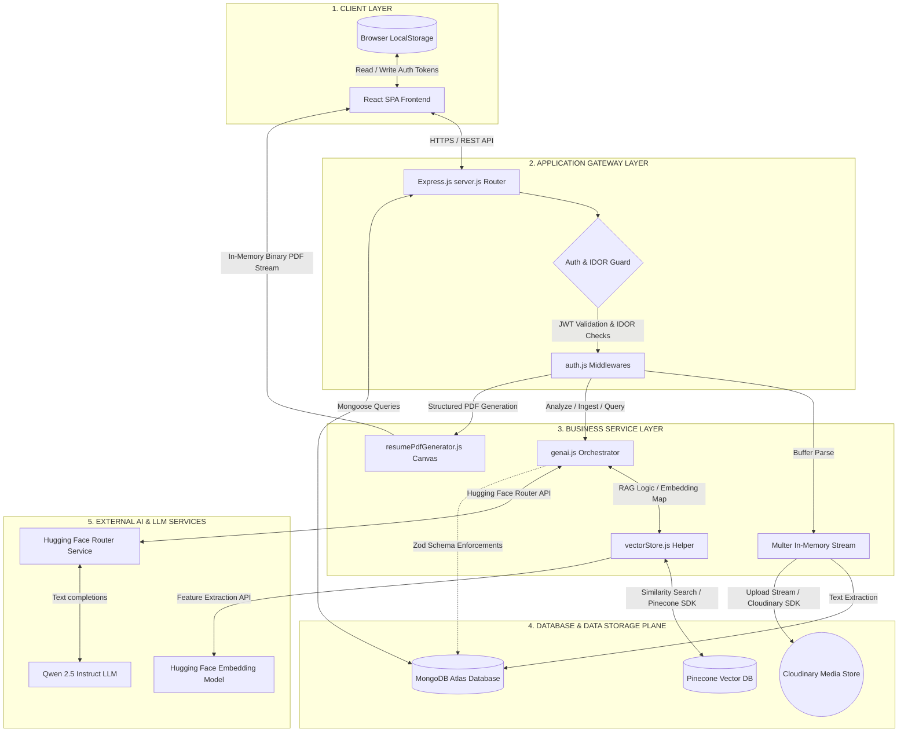

# AlignAI Component-Level High-Level Design (HLD) Architecture

This document outlines the structural component architecture and boundaries of the **AlignAI** platform, organized into logical application layers.

---

## A. HLD Architecture Diagram

The diagram below represents the system topology, showcasing how the client-side user interface, backend routing controllers, local database engines, and third-party AI services connect.



---

## B. Component Responsibilities

*   **React SPA Frontend:** Renders the user dashboard, handles multi-step intake wizard forms, and manages JWT tokens within client state.
*   **LocalStorage:** Caches active JWT access credentials and verified session flags locally in the browser.
*   **Express.js Server:** Mounts API routes, decodes request bodies, manages HTTP error states, and acts as the central coordination layer.
*   **Auth Guard Middlewares:** Decodes signed JWT headers to authenticate request origins and performs ownership parameter checks to block Insecure Direct Object Reference (IDOR) tampering.
*   **Multer In-Memory Stream:** Intercepts multipart/form-data uploads to capture PDF uploads inside RAM buffers, keeping the server stateless.
*   **genai.js Orchestrator:** Houses prompt formatting templates, extracts JSON blocks, and manages the execution flow for analysis, roadmaps, and interview preparations.
*   **resumePdfGenerator.js Canvas:** Renders JSON data into professionally formatted, single-column, ATS-friendly PDF resumes entirely in memory using the PDFKit library.
*   **vectorStore.js Helper:** Handles recursive character text splitting, initializes the PineconeStore connection, and partitions queries by namespace.
*   **MongoDB Atlas Database:** Persists operational database state, including user records, encrypted password hashes, and transactional history arrays.
*   **Cloudinary Media Store:** Serves as a media CDN to host and retrieve uploaded PDF resume documents.
*   **Pinecone Vector DB:** Provides a vector database index that isolates tenant document chunks inside user-specific namespaces.
*   **Hugging Face Embedding Model:** Generates 768-dimensional numerical vectors from raw text chunks using the `sentence-transformers/all-mpnet-base-v2` model.
*   **Hugging Face Router Service:** Routes chat completion requests in OpenAI-compatible formats to the `Qwen/Qwen2.5-7B-Instruct` model.

## C. 60-Second Interview Explanation

> "AlignAI is a full-stack resume optimization platform designed with a decoupled architecture organized into five logical layers.
> 
> At the **Client Layer**, we have a React Single Page Application compiled with Vite that communicates over HTTPS with our **Application Gateway Layer**, powered by Express.js. This gateway uses custom middlewares to handle authentication and IDOR security checks by validating signed JWT bearer tokens.
> 
> Business operations are handled in our **Business Service Layer**, which processes PDF extractions, coordinates prompt injection, and compiles PDF resumes programmatically in-memory using PDFKit.
> 
> Data persistence is split into two systems at the **Data Layer**: MongoDB Atlas stores user profiles and historical logs, while Cloudinary hosts raw PDF files.
> 
> Finally, our **External AI Layer** handles all semantic processing. We use LangChain to orchestrate similarity searches in Pinecone, partition data by user namespaces to ensure multi-tenant security, and call Hugging Face endpoints to handle embedding generation and Qwen 2.5 completions."

---

### D. Whiteboard Drawing & Interview Walkthrough Script

This section provides a detailed script of what to say and do as you draw the AlignAI component architecture diagram on a whiteboard during a system design or technical interview. It explains each component, interaction, and data transformation step in a conversational, human-friendly manner.

### Phase 1: Setting up the Whiteboard Layout
**What to Do:**
1. Stand at the whiteboard, take a marker, and draw four vertical dashed lines from the top of the board to the bottom, dividing the whiteboard into five columns.
2. Label these columns from left to right:
   *   `1. Client Layer`
   *   `2. Security Gateway`
   *   `3. Processing Services`
   *   `4. Database & Storage`
   *   `5. External AI Layer`

**What to Say:**
> "To keep our discussion organized, I'll divide the whiteboard into five logical columns. This represents the flow of requests from the user’s browser, through our security boundaries, into our business logic layers, and finally to our persistence and generative AI backends. 
> 
> This organization helps separate our frontend interfaces, backend routing, operational data persistence, and the semantic retrieval layer. By dividing the system this way, we can easily trace the boundaries of data ownership and pinpoint where our synchronous gateways transform into third-party asynchronous services."

---

### Phase 2: Drawing the Client Layer
**What to Do:**
1. In the first column (`1. Client Layer`), draw a large box and label it `React SPA Frontend (Vite)`.
2. Below the main React SPA box, draw a small bubble and label it `LocalStorage (JWT)`.
3. Draw a double-sided arrow connecting the `React SPA` box and the `LocalStorage` bubble, labeling the connection: `Read/Write Session Token`.
4. Draw an auxiliary box in column 1 labeled `api.js Fetch Wrapper` inside the React box.

```text
  [ Client Layer ]
 ┌─────────────────────────────────┐
 │    React SPA Frontend (Vite)    │
 │  ┌───────────────────────────┐  │
 │  │    api.js Fetch Wrapper   │  │
 │  └───────────────────────────┘  │
 └────────────────┬────────────────┘
                  │ (Read/Write Tokens)
 ┌────────────────▼────────────────┐
 │          LocalStorage           │
 │           (JWT Cache)           │
 └─────────────────────────────────┘
```

**What to Say:**
> "Let’s start with the client layer. Our frontend is a Single Page Application built using React and compiled with Vite. I chose Vite because it gives a fast developer experience, utilizes ES modules during development, and compiles down to highly optimized, lightweight static assets. 
> 
> Since our system is designed to be stateless, the frontend needs a reliable way to manage the user’s session state. We do this by storing a cryptographically signed JSON Web Token in the browser’s LocalStorage. Whenever the React client boots up, it reads this token using our custom api.js fetch wrapper. 
> 
> For any subsequent REST API requests, the fetch wrapper automatically intercepts the call and injects this token directly into the Authorization Bearer header. This keeps our routing clean and ensures that the client never has to manually manage headers on individual page requests. When the user logs out, we clear this LocalStorage item, terminating the session client-side immediately."

---

### Phase 3: Drawing the Application Gateway Layer
**What to Do:**
1. In the second column (`2. Security Gateway`), draw a box and label it `Express.js Router (server.js)`.
2. Draw a directional arrow from the `React SPA Frontend` in column 1 to the `Express.js Router` in column 2, labeling it: `HTTPS / JSON Payload`.
3. Inside the `Express.js Router` box, draw a nested diamond shape and label it `Auth Guard Middleware`.
4. Draw an arrow extending from the diamond to a small box below labeled `auth.js: protect() & verifyOwnership()`.
5. Draw a secondary diamond labeled `validateBody(requestSchema)`.

```text
  [ Client Layer ]             [ Security Gateway ]
 ┌─────────────────┐  HTTPS   ┌──────────────────────────────────────────┐
 │    React SPA    ├─────────>│            Express.js Router             │
 │    Frontend     │  Bearer  │ ┌─────────────────┐  ┌─────────────────┐ │
 └─────────────────┘  Token   │ │   Auth Guard    │─>│  validateBody   │ │
                              │ └────────┬────────┘  └─────────────────┘ │
                              └──────────┼───────────────────────────────┘
                                         │ Decode Token
                              ┌──────────▼──────────┐
                              │    auth.js Guard    │
                              └─────────────────────┘
```

**What to Say:**
> "Now, as the user interacts with the app, their requests cross the network boundary via HTTPS. In the second column, I'm drawing the Application Gateway, which is an Express.js server running in Node.js. The main entry point is `server.js`.
> 
> When a request hits our backend, before we touch any database or perform any business logic, it passes through a series of security filters. I'm drawing our Auth Guard Middleware diamond here to represent this layer. 
> 
> First, a helper middleware called `protect()` extracts the JWT from the header, validates its cryptographic signature using our server secret, and decodes the payload to bind the user’s ID to the request object. 
> 
> Second, to prevent Insecure Direct Object Reference or IDOR attacks—where User A tries to view User B’s history by guessing their database ID in the URL—we run a custom check called `verifyOwnership()`. This middleware compares the decoded user ID from the signed token with the user parameters in the request path. If they don't match, we block the request immediately at the gate and return a 403 Forbidden status code. 
> 
> Third, we run payload validation using a middleware named `validateBody` backed by request Zod schemas. This blocks malformed requests before they hit our processing layer, protecting our CPU resources."

---

### Phase 4: Drawing the Business Service Layer
**What to Do:**
1. In the third column (`3. Processing Services`), draw three boxes vertically stacked:
   *   Top: `Multer In-Memory Storage`
   *   Middle: `genai.js Orchestrator`
   *   Bottom: `PDFKit Canvas Engine`
2. Draw a directional arrow from the `Auth Guard Middleware` (column 2) to each of these three boxes.
3. Next to the `Multer` box, draw a small circle labeled `pdf-parse Engine` and connect them with an arrow.
4. Next to the `genai.js Orchestrator` box, draw a small box labeled `vectorStore.js Helper` and connect them with a double-sided arrow.

```text
  [ Security Gateway ]            [ Processing Services ]
 ┌─────────────────────┐         ┌─────────────────────────┐
 │  Express.js Router  │────────>│  Multer Memory Buffer   │──> [pdf-parse]
 │  (Auth & IDOR Guard)│         └─────────────────────────┘
 └─────────────────────┘         ┌─────────────────────────┐
            │                    │  genai.js Orchestrator  │<─> [vectorStore.js]
            └───────────────────>└─────────────────────────┘
            │                    ┌─────────────────────────┐
            └───────────────────>│   PDFKit Canvas Engine  │
                                 └─────────────────────────┘
```

**What to Say:**
> "Once the request is authenticated and verified, it moves into our third column: the Business Service Layer. This layer is entirely stateless and operates in-memory to keep performance high and support serverless deployment targets. I'm drawing three primary components here:
> 
> First, at the top, is our file ingestion engine. When a user uploads a resume, we don't save files to a temporary disk. Instead, we use `multer` configured with memory storage, which captures the binary PDF stream as a Buffer in RAM. We immediately pass this buffer to the `pdf-parse` library to extract raw text strings. This keeps the node instance lightweight and avoids filesystem write collisions under load.
> 
> In the middle is our `genai.js Orchestrator`. This is the core intelligence component of the application. It maps our prompt templates, handles context aggregation, extracts JSON substrings from model responses, and coordinates the flow for our resume analysis, roadmaps, and mock interview engines.
> 
> At the bottom is our `PDFKit Canvas Engine`. When a user requests a downloadable version of their rewritten resume, this service takes the optimized JSON data and programmatically draws a single-column, clean layout page-by-page. It calculates line wrapping and cursor coordinates dynamically, converting structured data back into a binary PDF buffer in-memory to stream it back to the user."

---

### Phase 5: Drawing the Database & Storage Layer
**What to Do:**
1. In the fourth column (`4. Database & Storage`), draw three cylinders to represent different database and storage systems:
   *   Top: `Cloudinary Media Store`
   *   Middle: `MongoDB Atlas (Transactional)`
   *   Bottom: `Pinecone Vector DB`
2. Draw a dashed arrow from the `Multer In-Memory Storage` box (column 3) to the `Cloudinary Media Store` cylinder.
3. Draw a solid arrow from the `pdf-parse Engine` circle (column 3) to the `MongoDB Atlas` cylinder, labeling it: `Mongoose Schema Write`.
4. Draw an arrow from the `vectorStore.js Helper` (column 3) to the `Pinecone Vector DB` cylinder, labeling it: `Upsert/Query Namespace`.

```text
  [ Processing Services ]             [ Database & Storage ]
 ┌─────────────────────────┐         ┌──────────────────────┐
 │  Multer Memory Buffer   │- - - - >│   Cloudinary Store   │
 └─────────────────────────┘         └──────────────────────┘
 ┌─────────────────────────┐         ┌──────────────────────┐
 │     pdf-parse Engine    │────────>│    MongoDB Atlas     │
 └─────────────────────────┘         └──────────────────────┘
 ┌─────────────────────────┐         ┌──────────────────────┐
 │   vectorStore.js Helper │────────>│  Pinecone Vector DB  │
 └─────────────────────────┘         └──────────────────────┘
```

**What to Say:**
> "Now let's talk about where this data goes. In column four, we have our database and storage tier. A key design pattern in AlignAI is the separation of our data planes into three separate systems based on access patterns:
> 
> First, at the top, we have the Cloudinary Media Store. We stream the original PDF buffer here asynchronously. This gives us a hosted URL for the raw file, which we save in the user's document as a profile metadata asset.
> 
> In the middle is MongoDB Atlas, which is our primary transactional database. We use Mongoose models to handle user credentials, password hashes, and profile fields. It also stores historical analysis logs. MongoDB is a great fit here because our history schema contains nested arrays of suggestions and strengths that can evolve over time.
> 
> At the bottom is the Pinecone Vector Database. Pinecone is a vector-native index designed specifically for semantic search. Rather than storing full user documents, it stores high-dimensional vector representations of our text chunks along with metadata payloads. 
> 
> To ensure data privacy, we partition Pinecone using user namespaces. This means when we execute a query or upsert, the database engine physically limits the search to the partition matching that specific user ID, preventing cross-user data leakage at the database level."

---

### Phase 6: Drawing the External AI Layer
**What to Do:**
1. In the fifth column (`5. External AI Layer`), draw three boxes:
   *   Top: `Hugging Face Feature Extraction`
   *   Middle: `Hugging Face Router API`
   *   Bottom: `Qwen 2.5 Instruct LLM`
2. Draw a directional arrow from the `vectorStore.js Helper` (column 3) to the `Hugging Face Feature Extraction` box, labeling it: `Text Chunks -> 768-dim Vectors`.
3. Draw a directional arrow from the `Hugging Face Feature Extraction` box back to `vectorStore.js Helper`, representing the returned vector arrays.
4. Draw a double-sided arrow between `genai.js Orchestrator` (column 3) and `Hugging Face Router API` (column 5), labeling it: `HTTPS / chat completions`.
5. Connect `Hugging Face Router API` to the `Qwen 2.5 Instruct LLM` box with an arrow.

```text
  [ Processing Services ]              [ External AI Layer ]
 ┌─────────────────────────┐          ┌──────────────────────┐
 │  vectorStore.js Helper  │<────────>│ HF Feature Extractor │ (Embeddings)
 └─────────────────────────┘          └──────────────────────┘
 ┌─────────────────────────┐          ┌──────────────────────┐
 │  genai.js Orchestrator  │<────────>│ HF Router API (Chat) │ (LLM Gateway)
 └─────────────────────────┘          └──────────┬───────────┘
                                                 │
                                      ┌──────────▼───────────┐
                                      │  Qwen 2.5 Instruct   │ (AI Model)
                                      └──────────────────────┘
```

**What to Say:**
> "Finally, let's look at how our business logic communicates with external machine learning components. In column five, we have the External AI Layer.
> 
> When our `vectorStore.js` helper needs to index text or perform a similarity search, it first sends the raw text chunks to the Hugging Face Feature Extraction API. This endpoint runs the `sentence-transformers/all-mpnet-base-v2` model, which takes the text strings and converts them into 768-dimensional numerical vectors. We return these arrays to Node, which then routes them to Pinecone.
> 
> When we need to perform reasoning—such as calculating a match score or generating resume rewrites—our `genai.js` orchestrator formats the system and user prompt messages and sends them to the Hugging Face Router API. 
> 
> We shifted to the Hugging Face Router base because it uses an OpenAI-compatible format which is robust and avoids local network timeout bugs. The router forwards these completions requests to the `Qwen2.5-7B-Instruct` model, which generates our response. 
> 
> Once Qwen returns the raw completion, the backend extracts the JSON substring, runs it through our Zod schema guardrails to enforce field typing, saves the validated report to MongoDB, and returns it to the client dashboard."

---

### Phase 7: Whiteboard Walkthrough of the PDF Ingestion Flow
**What to Do:**
1. Pick up a red marker (or point to the arrows with your finger) to trace the end-to-end data path as the user uploads a resume.
2. Trace the path: `User Browser` -> `React SPA` -> `Express.js Router` -> `Multer` -> `pdf-parse` -> `MongoDB` & `Cloudinary`.
3. Then trace from `pdf-parse` -> `vectorStore.js` -> `Hugging Face Feature Extraction` -> `vectorStore.js` -> `Pinecone User Namespace`.

```text
  [Client] ──(PDF File)──> [Express Gateway] ──> [Multer Memory Buffer]
                                                       │
                           ┌───────────────────────────┴───────────────────────────┐
                           ▼                                                       ▼
                [pdf-parse Extraction]                                     [Cloudinary Upload]
                           │                                                       │
                           ▼                                                       ▼
                [Save Text to MongoDB]                                   [Save URL to MongoDB]
                           │
                           ▼
              [Split Text to 1000-char Chunks]
                           │
                           ▼
              [HF Feature Extraction (Embed)]
                           │
                           ▼ (768-dim Vectors)
              [Pinecone Ingestion (user-namespace)]
```

**What to Say:**
> "To show how this architecture works under real application load, let's walk through what happens when a user uploads a new resume PDF:
> 
> First, the client browser packs the PDF file into a multipart form data request and sends it over HTTPS. The request is intercepted by the Express server, and the `protect` middleware decodes the user's JWT from the headers to ensure authentication.
> 
> The file stream is loaded into RAM by Multer. The backend immediately starts two async operations: it pipes the buffer to the `pdf-parse` library to extract raw characters, and uploads the file stream directly to Cloudinary. Once complete, it writes the extracted text, filename, and Cloudinary access URL to the user's document in MongoDB, establishing the transactional record.
> 
> Next, the server takes the extracted text string and splits it into 1000-character chunks with a 200-character overlap. We send these text segments to Hugging Face Feature Extraction to generate 768-dimensional vector arrays. 
> 
> Finally, the server takes these vectors, attaches metadata identifying them as resume chunks, and indexes them in Pinecone inside the `user-{userId}` namespace, completing the indexing pipeline."

---

### Phase 8: Whiteboard Walkthrough of the RAG Analysis Flow
**What to Do:**
1. Trace the query path: `User Job Description` -> `Express Gateway` -> `genai.js` -> `vectorStore.js` -> `Pinecone` -> `Hugging Face Router (Qwen)` -> `Zod Schemas` -> `MongoDB` & `React SPA`.

```text
  [Job Description] ──> [Express Gateway] ──> [Ingest JD to Pinecone]
                                                       │
                                                       ▼
                                            [Embed JD Query Vector]
                                                       │
                                                       ▼
                                     [Query Pinecone User Namespace]
                                                       │
                                                       ▼ (Top 6 matched chunks)
                                          [Format RAG Context Block]
                                                       │
                                                       ▼
                                       [Prompt + Context -> HF Router]
                                                       │
                                                       ▼ (Qwen 2.5 JSON)
                                         [Extract JSON & Zod Parse]
                                                       │
                                                       ▼
                                      [Save Report to MongoDB History]
                                                       │
                                                       ▼
                                            [JSON Payload to Client]
```

**What to Say:**
> "Next, let's trace the core RAG analysis flow when the user submits a target job description:
> 
> The frontend sends a JSON body containing the JD, job title, and company name to our `/analyze` endpoint.
> 
> The server first split-chunks and indexes this new Job Description into Pinecone. Then, it constructs a search query vector based on the JD and target role, sending a similarity search request to Pinecone inside the user’s namespace.
> 
> Pinecone executes a cosine similarity search against all vectors in that namespace and returns the top-6 most relevant chunks—which usually include matching paragraphs from the candidate’s resume, previous analysis summaries, and related job description clauses.
> 
> The orchestrator takes these 6 text chunks, compiles them into a structured RAG context block, and inserts them into our prompt template. We send this combined prompt to the Hugging Face Router API, which hits Qwen 2.5.
> 
> Qwen generates the raw text completion. The server extracts the JSON block from the text response, validates the fields against our Zod schema to ensure no data is missing or corrupted, writes the finalized analysis report to MongoDB, and sends the JSON payload back to the client dashboard to render the analysis widgets."

---

### Phase 9: Whiteboard Walkthrough of the PDF Resume Generation Flow
**What to Do:**
1. Trace the PDF compile path: `React SPA` -> `Express Gateway` -> `PDFKit Canvas` -> `Response Stream` -> `User Browser`.

```text
  [Request PDF] ──> [Express Gateway] ──> [PDFKit Canvas Canvas Engine]
                                                       │
                                                       ▼ (Format layout / margins)
                                            [In-Memory Binary PDF]
                                                       │
                                                       ▼
                                            [Response Stream Header]
                                                       │
                                                       ▼
                                          [Trigger Download in Browser]
```

**What to Say:**
> "Finally, let's look at the PDF download flow:
> 
> When the user clicks 'Download PDF', the frontend sends the optimized, structured JSON resume text to `/download-resume-pdf`.
> 
> Our PDFKit Canvas engine takes this JSON payload and initializes a blank letter-sized document canvas in RAM. It iterates through the sections—like summary, skills, and projects—and draws the text programmatically using standard Helvetica fonts. It checks the vertical cursor coordinate `doc.y` before writing each bullet point: if the coordinate exceeds our margin bounds, it triggers a page break.
> 
> Once the layout is drawn, the engine compiles the canvas into a binary buffer. The backend sets the Content-Disposition headers to trigger an attachment download and streams the binary buffer directly back to the user's browser, bypassing local disk writes entirely to ensure statelessness."

---

### Phase 10: Infrastructure, Docker, and Nginx Routing
**What to Do:**
1. At the bottom of the whiteboard, draw a container box enclosing columns 1, 2, 3, and 4 (except the external APIs).
2. Label this container box: `Docker Compose Environment`.
3. Draw a box at the entry point of this container labeled `Nginx Reverse Proxy`.
4. Draw arrows showing Nginx routing port `8080` requests to `React Frontend` and port `5000` requests to the `Express Gateway`.

```text
 ┌─────────────────────────────────────────────────────────────────────────┐
 │ Docker Compose Environment                                              │
 │                  ┌──────────────────────┐                               │
 │                  │ Nginx Reverse Proxy  │                               │
 │                  └──────────┬───────────┘                               │
 │       Port 8080             │               Port 5000                   │
 │     ┌───────────────────────┴───────────────────────┐                    │
 │     ▼                                               ▼                   │
 │ ┌───────────┐                                   ┌───────────┐           │
 │ │ React SPA │                                   │  Express  │           │
 │ └───────────┘                                   │  Gateway  │           │
 │                                                 └───────────┘           │
 └─────────────────────────────────────────────────────────────────────────┘
```

**What to Say:**
> "To talk briefly about how this system is deployed, we run the client, gateway, and operational database services containerized inside a Docker Compose environment. 
> 
> At the network boundary of this environment, we place an Nginx Reverse Proxy. Nginx acts as our primary web server. When requests hit our public IP, Nginx inspects the port and route:
> 
> Port 8080 traffic represents our frontend, so Nginx serves our compiled static React bundle directly. Port 5000 traffic represents our backend API endpoints, so Nginx acts as a reverse proxy, forwarding requests to our Express container. 
> 
> This setup simplifies local deployment, ensures that our Dev and Prod environments are identical, and allows us to easily add SSL termination or load balancing at the Nginx layer if traffic scales."

---

### Phase 11: Scalability, Caching, and Message Queues
**What to Do:**
1. Draw a cylinder to the side of column 3 and label it `Redis Cache`.
2. Connect `genai.js Orchestrator` to `Redis Cache` with a double-sided arrow.
3. Draw a box between column 3 and column 4 labeled `BullMQ Queue (Redis backed)`.

```text
 ┌─────────────────────────┐                 ┌─────────────┐
 │  genai.js Orchestrator  │────────────────>│ Redis Cache │ (Cache Hits)
 └───────────┬─────────────┘                 └─────────────┘
             │
             ▼ (Push Job)
 ┌─────────────────────────┐
 │  BullMQ Queue Handler   │──> [Worker Nodes]
 └─────────────────────────┘
```

**What to Say:**
> "If we were scaling this application to handle 10,000 concurrent analyses, the synchronous pipeline would bottleneck on Hugging Face’s generation speed. To mitigate this, we would introduce two components:
> 
> First, a Redis Caching layer. We would generate an MD5 hash of the combined resume and job description. Before running any vector search or calling the LLM, we check Redis. If a matching hash exists, we return the cached JSON analysis payload instantly, reducing response times from 3 seconds to under 10 milliseconds.
> 
> Second, a message queue like BullMQ backed by Redis. Instead of running the analysis synchronously, the Express gateway immediately returns a job ID to the client with a 202 Accepted status. 
> 
> Independent worker processes scale up dynamically to consume jobs from the queue, execute the RAG retrieval, query the LLM, validate the output, write it to MongoDB, and trigger a WebSocket notification or SSE event to alert the client when the report is ready. This prevents Node’s event loop from blocking and keeps our gateway highly responsive."

---

### Phase 12: Advanced Search (Hybrid Search & Reranking)
**What to Do:**
1. Draw a box next to Pinecone labeled `BM25 Full-Text Index`.
2. Draw a box between `vectorStore.js` and Pinecone labeled `Cohere Reranker Model`.

```text
 ┌─────────────────────────┐
 │  vectorStore.js Helper  │
 └───────────┬─────────────┘
             ├──────────────────────────┐
             ▼                          ▼
      ┌──────────────┐           ┌──────────────┐
      │ Pinecone DB  │           │  BM25 Index  │
      │ (Semantic)   │           │  (Keyword)   │
      └──────┬───────┘           └──────┬───────┘
             │                          │
             └───────────┬──────────────┘
                         ▼ (Top 20 candidate chunks)
                  ┌──────────────┐
                  │ Cohere Rerank│ (Re-evaluate relevance)
                  └──────┬───────┘
                         ▼ (Top 6 final RAG context)
                    [GenAI Prompt]
```

**What to Say:**
> "To push retrieval precision from our baseline of 95% to 99%, we would upgrade our retrieval architecture from standard vector similarity to a Hybrid Search pipeline with Reranking:
> 
> Instead of querying Pinecone alone, we send the search query to both our Pinecone vector index (for semantic meaning) and a BM25 index (for exact technical keyword matching). 
> 
> We merge the retrieval lists and take the top 20 candidate chunks. We pass these candidate chunks to a cross-encoder model—like Cohere Rerank. The reranker re-evaluates the exact relevance of each chunk against the job description, filtering out noise and ordering them.
> 
> We select the top 6 reranked chunks to inject into the LLM prompt. This ensures that the model is grounded on the most precise evidence possible, eliminating irrelevant context and drastically reducing hallucination risks."

---

### Phase 13: Handling Stress Questions
**What to Say:**
> "Finally, let's talk about how the system handles critical infrastructure failures:
> 
> *   **What if Pinecone fails?** We catch the retrieval exception and fallback gracefully to a one-shot analysis, sending the entire raw resume and job description directly to Qwen.
> *   **What if Hugging Face rate-limits us?** We configure a circuit breaker pattern in our API client. If we receive a 429 Too Many Requests, we immediately route requests to an alternative LLM endpoint or a local backup model.
> *   **What if MongoDB database writes succeed but Pinecone indexing fails?** To prevent inconsistent states, we execute the operation within a database transaction. If the Pinecone indexing fails, we rollback the Mongoose write and return a clean error to the client, prompting them to upload again.
> 
> This decoupled, stateless service design ensures our platform remains stable, secure, and ready to scale under load."

---

### Phase 14: Follow-up Whiteboard Q&A and Explanations
**What to Do:**
Write three bullet points on the whiteboard:
*   *ACID vs. Semantic Partitioning*
*   *Memory Overhead during Concurrency*
*   *Cold Start Mitigations*

**What to Say:**
> "If the interviewer pushes deeper on system operational stability, here is how I explain our core design tradeoffs:
> 
> First, on ACID vs. Semantic Partitioning. We deliberately keep transactional state in MongoDB Atlas and semantic search vectors in Pinecone. Some developers try to store vectors directly in PostgreSQL using pgvector to simplify their database stack. However, doing so mixes two very different workloads. Operational databases require fast, ACID-compliant writes for logs, auth profiles, and logins. Vector search, on the other hand, is highly CPU-intensive due to floating-point distance calculations. By separating our operational data plane from our vector retrieval plane, we ensure that a traffic spike in resume analyses can never degrade core login, profile viewing, or authentication speeds.
> 
> Second, regarding Memory Overhead during Concurrency. Since our PDF parser acts on raw buffers in Node memory without writing temporary files to disk, we face potential RAM bottlenecks. Under high concurrent traffic, multiple large PDF uploads could lead to Node's garbage collector falling behind, potentially causing out-of-memory crashes. In a production environment, I would decouple the PDF parsing task into an independent, serverless microservice. The Express server would forward incoming file buffers to an AWS Lambda function or a Docker container running PyPDF2. This offloads the CPU and memory pressure from our main event loop, allowing the API gateway to stay responsive.
> 
> Third, regarding Cold Start Mitigations on Hugging Face. Hugging Face serverless models can occasionally sleep when inactive, introducing a cold-start latency spike of 10 to 15 seconds on the first request. To prevent this from ruining the user experience, we implement two solutions: we configure our client-side dashboard with useful skeletons and progress bars so the user knows analysis is running, and we configure a ping script that heartbeats our Hugging Face models every 10 minutes. This keeps the containers hot in the Hugging Face router pool, ensuring standard response times remain under 3 seconds."


